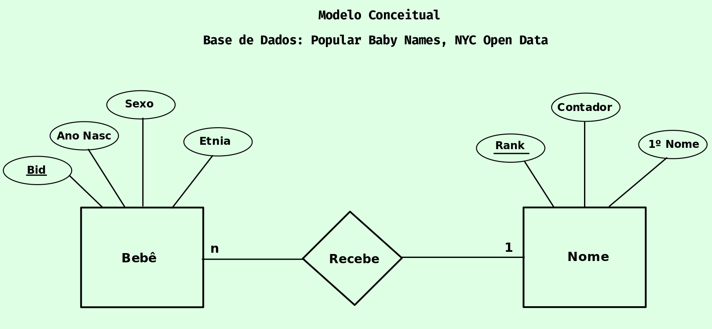

# Lab01 - API Acesso

Estrutura de pastas:

~~~
├── README.md  <- arquivo apresentando a tarefa
│
├── images     <- arquivo de imagem da tarefa
│
└── notebook   <- arquivos do notebook
~~~

# Aluno
* `Jhonatan Cléto`
* `RA: 256444`

## Tarefa 1 sobre APIs de acesso

> [Notebook da Atividade](./noteboks/lab01-api.ipynb).

## Tarefa 2 sobre Engenharia Reversa
> [Nomes populares de bebês](https://data.cityofnewyork.us/Health/Popular-Baby-Names/25th-nujf) por sexo e grupo étnico nascidos em NY.
>
> 