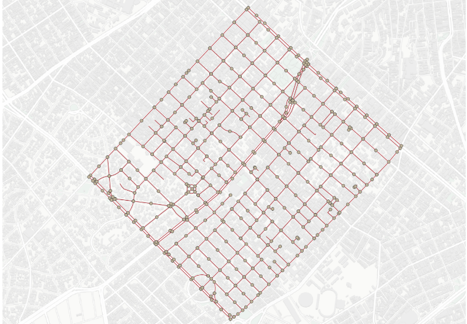
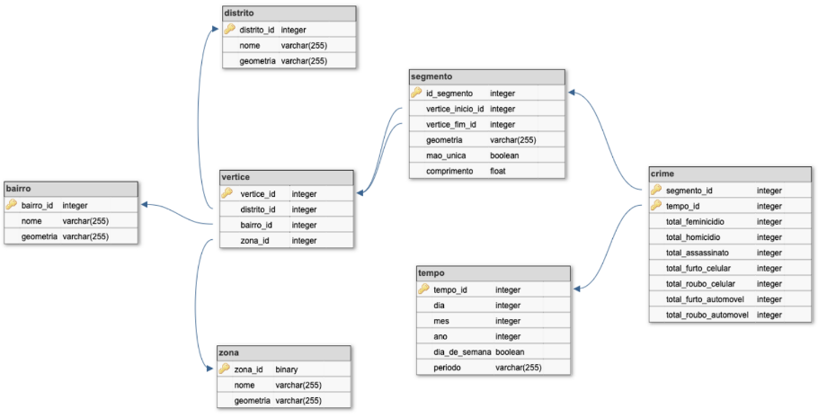

# Lab06 - Artigo de Dataset Público

Estrutura de pastas:

~~~
├── README.md  <- arquivo apresentando a tarefa
│
└── images     <- arquivos de imagem usados na tarefa (se houver)
~~~

# Aluno
* `256444`: `Jhonatan Cléto`

# Análise do Artigo `PolRoute-DS: um Dataset de Dados Criminais para Geração de Rotas de Patrulhamento Policial.`

| campo | valor |
|------------|----------------------------------------|
| referência | Sá, B. C., Muller, G., Banni, M., Santos, W., Lage, M., Rosseti, I., Frota, Y. & Oliveira, D. (2021). PolRoute-DS: Um Dataset de Dados Criminais para Geração de Rotas de Patrulhamento Policial. Dataset Showcase Workshop, SBBD 2021.  |
| link       | [PolRoute](https://drive.google.com/file/d/10Q_T1TANC5BtEBpPexsTv7-gfOLva5X2/view?usp=sharing) |
| dataset | [PolRoute-DS](https://osf.io/mxrgu/) |
| formato | `CSV` |

## Resumo

> Resumo do artigo com as suas palavras (não deve ser copiado total ou parcialmente o resumo do artigo).

No artigo os autores apresentam o PolRoute-DS, um dataset que combina a estrutura espacial da cidade de interesse - No momento apenas São Paulo - com índices criminais obtidos de fontes públicas. A combinação se dá através de um Grafo conexo, no qual os vértices são encontro de vias ou junções de segmentos de uma mesma via, os segmentos de vias são as arestas nas quais os índices criminais compoẽm seus pesos. O Grafo é apresentado em um banco de dados relacional que segue o modelo Data Mart com esquema floco-de-neve. A modelagem do PolRoute-DS é composta de 7 tabelas: Crime, Segmento, Vértice, Tempo, Distrito, Zona e Bairro. 

O objetivo do PolRoute-DS é viabilizar o desenvolvimento de testes de abordagens de gerações de rotas policiais em centros urbanos.

O dados do PolRoute-DS estão sobre a licença *Creative Commons* e podem ser obtidos a partir do formato `CSV`.

## Perguntas de pesquisa/análises

> Escreva de forma resumida que perguntas de pesquisa/análises podem ser feitas com o dataset.

1) Com esse Dataset é possível analisar a variação granularidade de incidentes criminais no tempo, em diferentes zonas de uma cidade. Com isso, é possível determinar períodos do ano com maior ocorrência de crimes em uma determinada região.

2) Com os dados disponíveis, é possível criar rastros de incidentes criminais do mesmo tipo ao longo da malha viaria de uma cidade, podendo estabelecer conexões entre o tipo de crime e as características dos locais, onde esse tipo de crime ocorre com mais frequência.

3) Utilizando o PolRoute-DS é possível verificar se as estratégias de policiamento adotadas em uma cidade são efetivas, pois é possível comparar os índices criminais de uma certa zona da cidade em diferentes períodos de tempo.

## Trabalhos relacionados

> Relacione outras iniciativas relacionadas com a do artigo que tenham sido mencionadas no mesmo.

* **Crime data warehousing and crime pattern discovery** (Yoo 2019):
	- Descreve como materializar em um único banco de dados, informações espaciais e de ocorrências criminais que podem ser úteis para construir soluções de combate a violência.

* **Crime Data-Warehouse** (Royal Canadian Mounted Police):
	- Reune em um Data Warehouse múltiplos datasets sobre eventos de crime relatados oficialmente para as autoridades policiais da cidade de Burnaby, no Canada.

* **G-FranC**:
	- Utiliza uma abordagem baseatda em redes complexas, para propor métricas para detectar regiões com alto índice de criminalidade na cidade de São Francisco, nos Estados Unidos.
