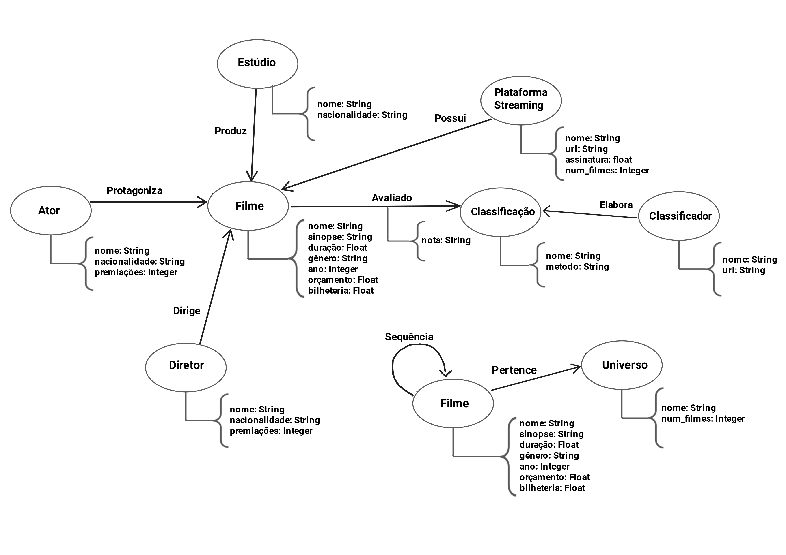

# Lab07 - Modelo Lógico para Banco de Dados de Grafos

Estrutura de pastas:

~~~
├── README.md  <- arquivo apresentando a tarefa
│
└── images     <- arquivos de imagem usados na tarefa
~~~

# Aluno
* `256444`: `Jhonatan Cléto`

## Modelo Lógico do Banco de Dados de Grafos

## Perguntas de Pesquisa/análise

* Qual Plataforma de Streamming oferece o melhor custo-benefício em relação a quantidade e qualidade (boa avaliação) dos filmes disponíveis no seu catalogo versus o preço da sua assinatura?

* Qual a média de avaliações realizadas pela Classificação A de filmes dirigidos pelo Diretor X ou protagonizados pelo Ator Y?

* Qual Franquia ou Universo cinematografico, faturou mais com bilheterias até o atual momento?

* Quais são os Atores e Diretores mais contratados para participar da produção de filmes pelo Estudio X?