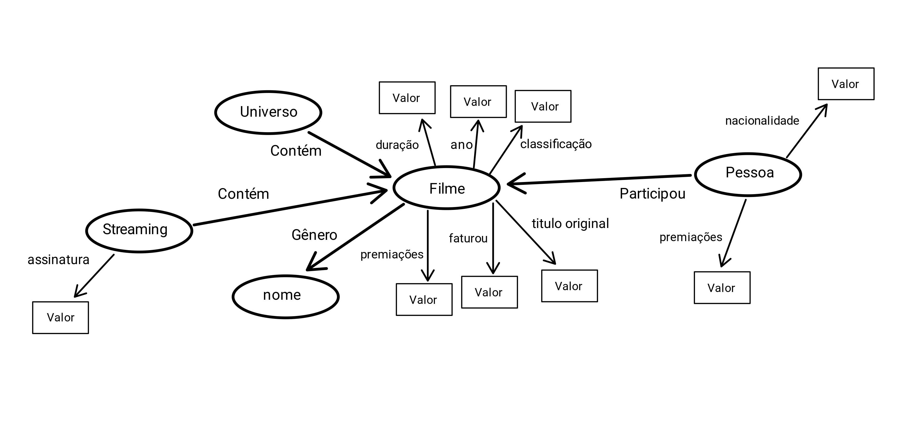
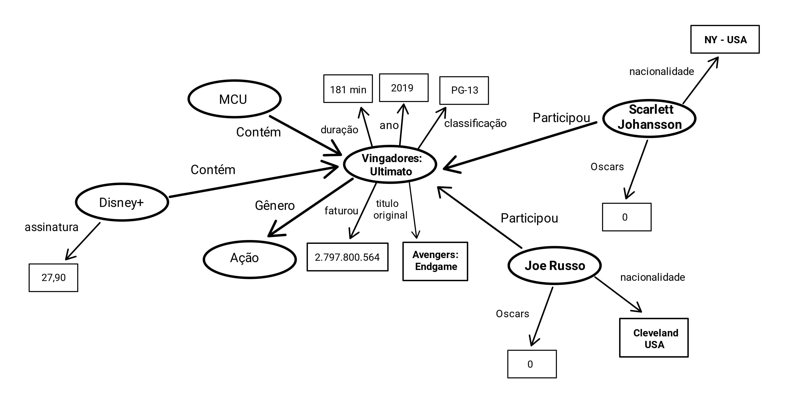

# Lab09 - Grafo de Conhecimento

# Aluno
* `256444`: `Jhonatan Cléto`

## Exemplo de Grafo de Conhecimento - para publicar ou enriquecer

Utilizando as informações sobre a indústria cinematográfica contidas no Dataset, podemos montar um grafo de conhecimento, transformando as entidades do contexto em recursos e suas relações em propriedades que associam esses recursos.

### Grafo de Conhecimento com classes

### Exemplo de Grafo de Conhecimento 

## Perguntas de Pesquisa ou Queries

* Qual é o filme com maior faturamento que a pessoa X participou?

* Qual é o gênero com maior quantidade de filmes na plataforma de streaming X?

* A pessoa X já participou de algum filme do universo cinematográfico Y?